## Design First API 

OpenApi et AsyncApi en action !!!

## Les APIs ?


### Les APIs ?


* Les débuts : génération HTML

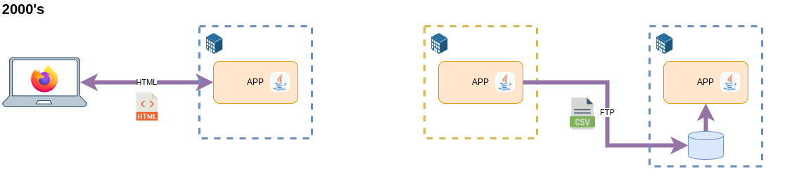


Lorsque j’ai embrassé le développement Java en 2001, tout était généré côté serveur on génrait alors du HTML (via des JSP) qui était transmis au navigateur web.
Pour ce qui était de la communication entre applications ou entreprises il était coutume de s’échanger des fichiers contenant les données via FTP (ou autre) qui étaient traité essentiellement par batch.

### Les APIs ?


* On progresse : AJAX et SOAP

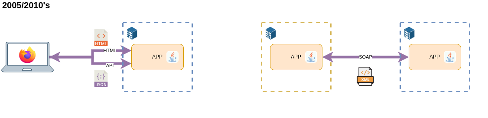


Les technologies ont peu à peu évolués et l’apparition d’AJAX à permeis de mettre en place de premières APIs, une partie de l’écran était alors rafraichie par un appel serveur qui ne renvoyait que les données nécessaires.
Dans les années 2005 la technologie SOAP commenaçait à faire son apparition dans les entreprises pour des échanges synchrones de données entres applications.

### Les APIs ?


* La maturité ? API REST et EDA

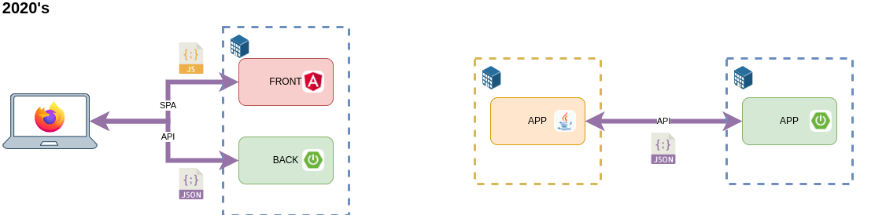


Aujourd’hui les framework tels que Angular, VueJs ou React permettent de découper les applications en deux blocs (front et backend) l’un soccupant exclusivement de l’IHM et le backend exposant des APIs REST où seules les données nécessaires transitent.
Ces APIs peuvent être utilisées pour un échange synchrone entre applications, et nous voyons égalment se développer des technologies asynchrone comme Kafka ou RabbitMQ par exemple.

## Démarche API

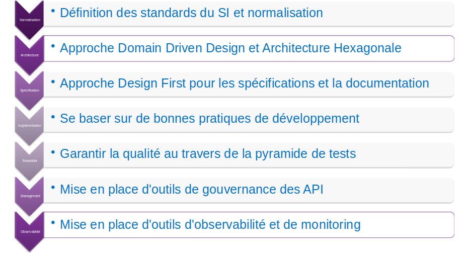


Pour ma part je travaille autour des APIs depuis les années 2010, et fort de cette expérience j’ai mis en place dans ma société une démarche pour la mise en place d’APIs.

Cela part de la définition de standard, jusqu’à l’observabilité et le monitoring, en passant par l’architecture, les bonnes pratiques de développement et...

### Démarche API

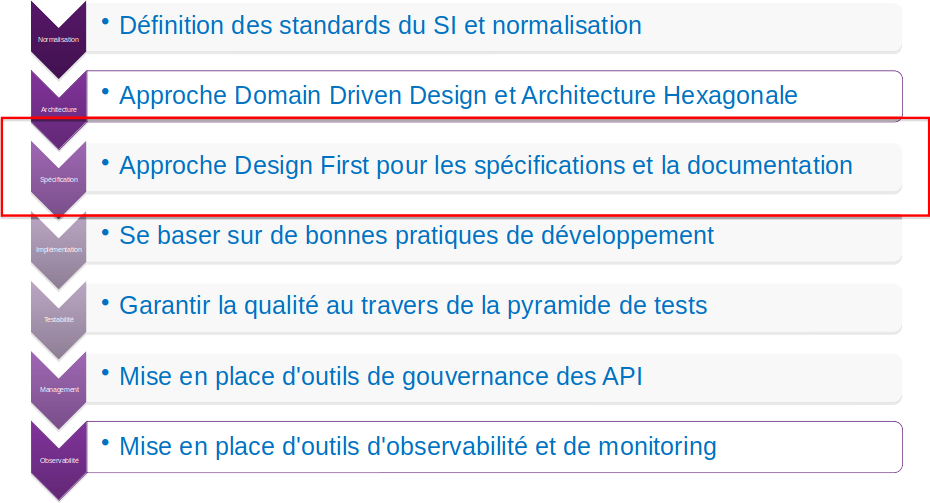


Ce qui nous intéresse aujourd’hui l’approche Design First...

## Code First

* Coder directement dans son IDE

```java
@RestController
public class HelloApi {

    @RequestMapping(
        method = RequestMethod.GET,
        value = "/api/v1/hello",
        produces = { "application/json" }
    )
    public ResponseEntity<HelloDto> hello() {
        HelloDto result = new HelloDto();
        result.setMessage("Hello World");
        return ResponseEntity.ok(result);
    }

    @RequestMapping(
        method = RequestMethod.GET,
        value = "/api/v1/hello/{name}",
        produces = { "application/json" }
    )
    public ResponseEntity<HelloDto> helloWithName(String name) {
        HelloDto result = new HelloDto();
        result.setMessage("Hello "+name);
        return ResponseEntity.ok(result);
    }
}
```


Avant de parler de Design First voyons l’approche Code First.

Il s’agit de développer directement son API dans son IDE préféré

Pour tester on s’appuie sur des outils comme Postman, vu que c’est nous qui avons développé on sait de facto comment appler notre API

### Code First

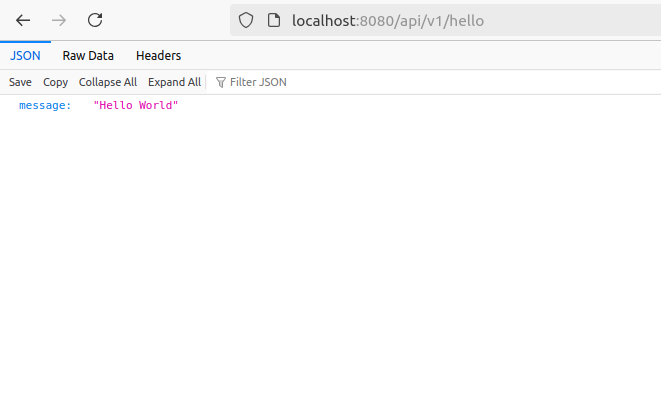


Cependant cela manque de Documentation, un développeur comprendra ce code et saura comment appeler l’API, mais les autres ?

D’ailleurs lorsqu’on expose une API c’est pour qu’elle soit consommée par quelqu’un, il faut donc pouvoir expliquer à celu-ci comment appeler notre APIs.

Cela se faisait souvent via un document annexe, et cela se passait souvent dans la douleur, fautes de frappes, erreurs dans la documentation.

Bilan c’est grandement perfectible

### Swagger-UI

* SpringDoc : une documentation minimaliste

```xml
<!-- Swagger / OpenAPI -->
<dependency>
  <groupId>org.openapitools</groupId>
  <artifactId>jackson-databind-nullable</artifactId>
  <version>0.2.4</version>
</dependency>
<dependency>
  <groupId>org.springdoc</groupId>
  <artifactId>springdoc-openapi-starter-webmvc-ui</artifactId>
  <version>${springdoc-openapi.version}</version>
</dependency>
<dependency>
  <groupId>org.springdoc</groupId>
  <artifactId>springdoc-openapi-starter-common</artifactId>
  <version>${springdoc-openapi.version}</version>
</dependency>
```


Nous pouvons cependant bénéficier d’une documentation minimaliste en ajoutant des librairies comme springfox (dépréciées) ou springdoc.

### Swagger-UI

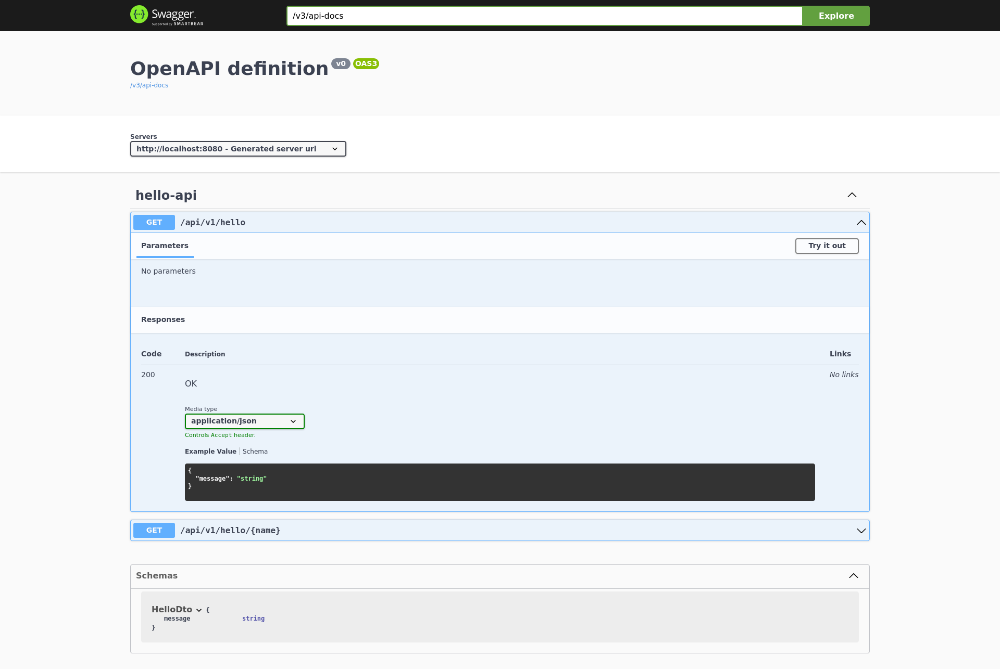


Mais nous n’auront alors qu’une documentation minimaliste

### Les Annotations

* Annotations OpenApi : une meilleure documentation 

```java
@RestController
public class HelloApi {

// [...]

    @RequestMapping(
        method = RequestMethod.GET,
        value = "/api/v1/hello/{name}",
        produces = { "application/json" }
    )
    @Operation(
        operationId = "helloWithName",
        summary = "Saluer une personne en particulier",
        tags = { "Hello" },
        responses = {
            @ApiResponse(responseCode = "200", description = "OK", content = {
                @Content(mediaType = "application/json", 
                schema = @Schema(implementation = HelloDto.class))
            }),
        }
    )
    public ResponseEntity<HelloDto> helloWithName(
    	@Parameter(
    		name = "name", 
    		description = "Nom de la personne à saluer", 
    		required = true
    	) 
    	@PathVariable("name") 
    	String name) {
	        HelloDto result = new HelloDto();
        	result.setMessage("Hello "+name);
	      	return ResponseEntity.ok(result);
    }
}
```


Les annotations fournies par OpenApi permettent tout de même d’ajouter de la documentation,
Cependant le code utile est vite noyé au milieu d’annotations documentaires.

### Les Annotations

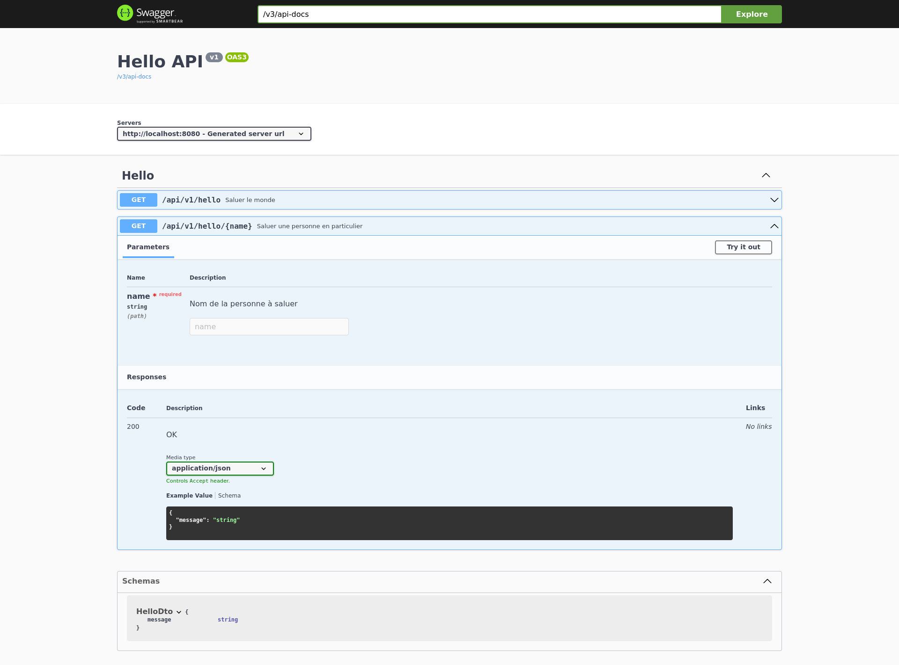


Et cette documentation n’est au final disponible qu’une fois l’API impléménté.

### La Documentation

```json
{
   "openapi":"3.0.1",
   "info":{
      "title":"Hello API",
      "version":"v1"
   },
   "servers":[
      {
         "url":"http://localhost:8080",
         "description":"Generated server url"
      }
   ],
   "paths":{
      "/api/v1/hello":{
         "get":{
            "tags":[
               "Hello"
            ],
            "summary":"Saluer le monde",
            "operationId":"hello",
            "responses":{
               "200":{
                  "description":"OK",
                  "content":{
                     "application/json":{
                        "schema":{
                           "$ref":"#/components/schemas/HelloDto"
                        }
                     }
                  }
               }
            }
         }
      },
      "/api/v1/hello/{name}":{
         "get":{
            "tags":[
               "Hello"
            ],
            "summary":"Saluer une personne en particulier",
            "operationId":"helloWithName",
            "parameters":[
               {
                  "name":"name",
                  "in":"path",
                  "description":"Nom de la personne à saluer",
                  "required":true,
                  "schema":{
                     "type":"string"
                  }
               }
            ],
            "responses":{
               "200":{
                  "description":"OK",
                  "content":{
                     "application/json":{
                        "schema":{
                           "$ref":"#/components/schemas/HelloDto"
                        }
                     }
                  }
               }
            }
         }
      }
   },
   "components":{
      "schemas":{
         "HelloDto":{
            "type":"object",
            "properties":{
               "message":{
                  "type":"string"
               }
            }
         }
      }
   }
}
```


## Le Design First


* IL S’AGIT DE SPÉCIFIER L’API EN AMONT
* IMPLÉMENTER PLUS EFFICACEMENT VOS APIS
* INTÉGRER PLUS FACILEMENT LES APPELS À VOS APIS
* POSSIBILITÉ DE SIMULER VOS APIS
* DOCUMENTATION EN ADÉQUATION AVEC L’IMPLÉMENTATION


N’y a t’il pas moyen de proposer un contrat d’interface, lorsque nous exposions des Webservices SOAP nous échangiosn avec le consommateur un contrat le fameux WSDL.

Le Design First va nous aider ​t doit nous permettre : 

D’implementer plus efficacement nos APIs 
Permettre aux consomateurs d’intégrer plus facilement des appels APIs
Ces deux points grâce à de la génération de code à partir du contrat d’interface

Mais ce contrat offre d’autres possibilité comme 
La possibilité de simuler une API ou servir de documentation technique qui est de facto en adéquation avec ce qui a été implémenté.

## OpenApi et AsyncApi

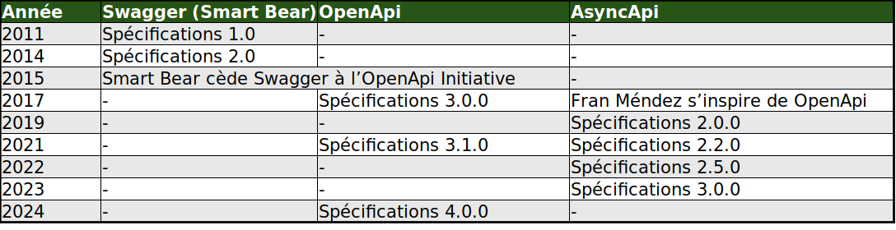


### Les Initiatives

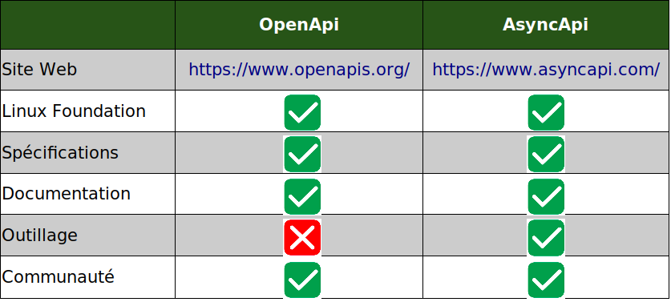


### Les Spécifications

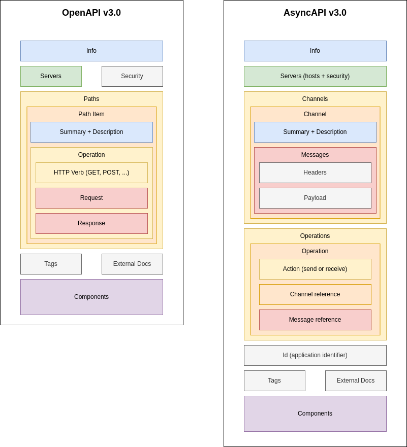

## Notre Cas d'Usage

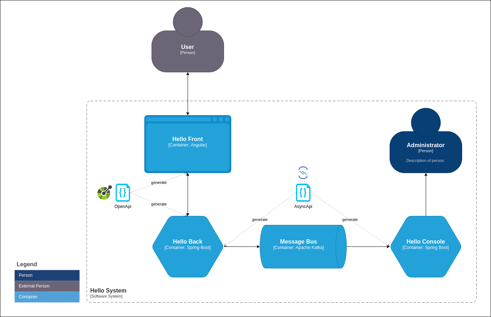

Pour tenter de vous démontrer tout cela nous allons prendre un cas d’usage simple

* Front qui permettra d’aficher le résultat de notre API (Angular) 
* Un backend qui expose une API Hello World (Spring Boot)
* Il émettra également un message dans un topic Kafka
* Qui sera consommé par une application qui l’affichera dans la console

## Définir son API REST

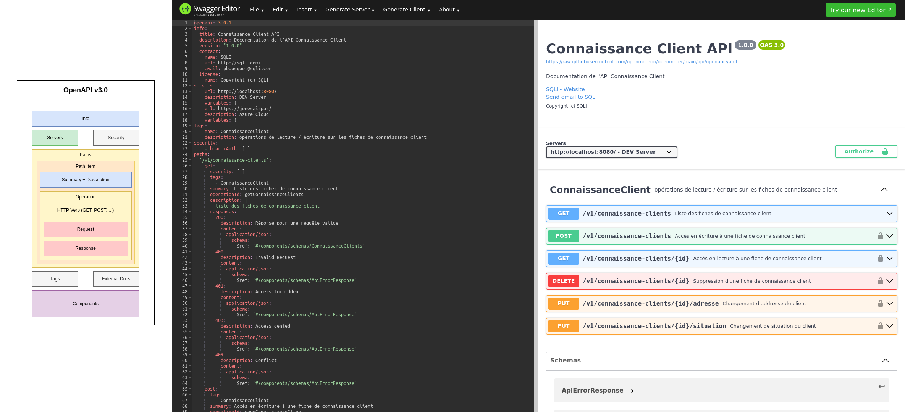


[https://editor.swagger.io/](https://editor.swagger.io/)


### Des outils

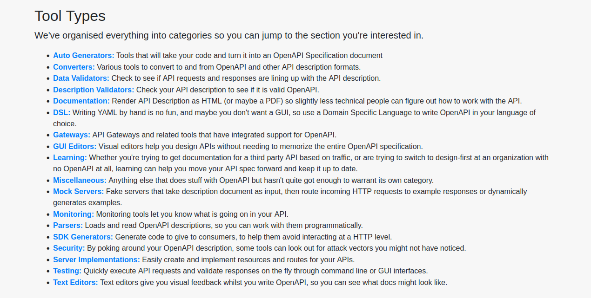


[https://openapi.tools/](https://openapi.tools/)


### Démo


## Génération Client

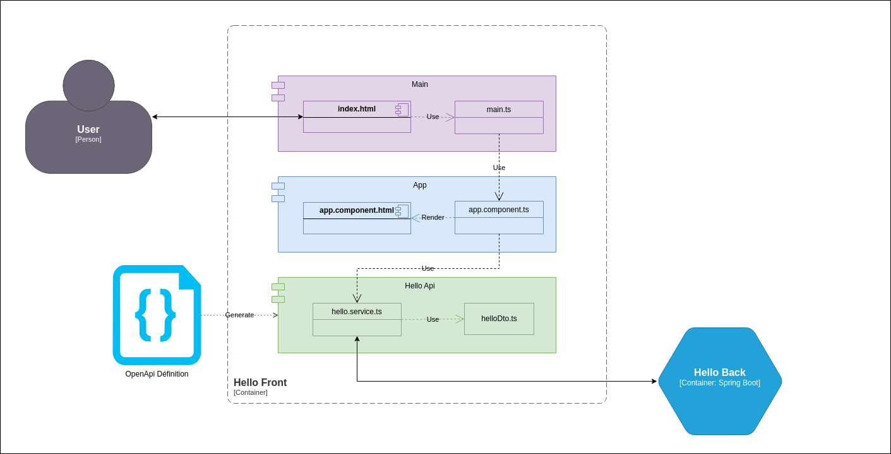

```json
{
  "name": "hello-world",
  "version": "1.0.0",
  "scripts": {
    "generate:api": "openapi-generator-cli generate -i ../../hello.yaml -g typescript-angular -o src/app/hello-api"
  },
  ...
}  
```


### Intégrer l'appel API


```typescript
import { Component } from '@angular/core';
import { HelloService } from './hello-api/api/hello.service';

@Component({
  selector: 'app-root',
  templateUrl: './app.component.html',
  styleUrls: ['./app.component.scss'],
})
export class AppComponent { 
  title = 'Appel de l\'api hello';
  result = this.helloService.helloUsingGET1()
  		.subscribe(helloDto => (this.title = helloDto.message!));
  constructor(private helloService: HelloService){}
}
```


[http://localhost:4200/](http://localhost:4200/)


### Démo


## Génération Serveur

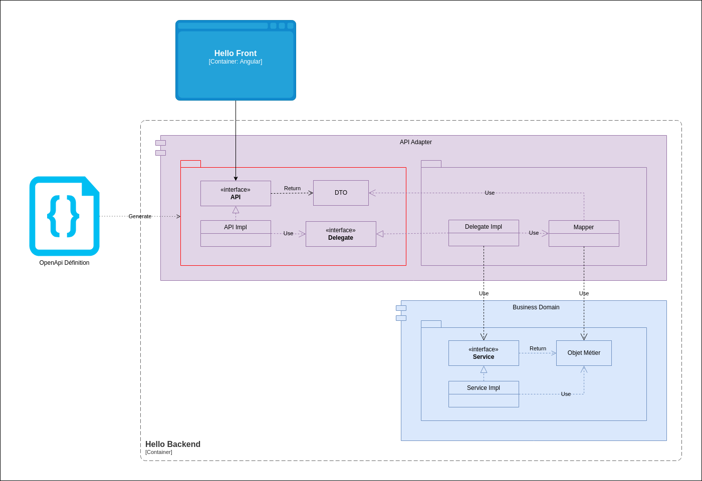


[Open API Generator](https://github.com/OpenAPITools/openapi-generator)


### Pluggin Maven


```xml
<plugin>
  <groupId>org.openapitools</groupId>
  <artifactId>openapi-generator-maven-plugin</artifactId>
  <version>${openapi-generator-maven.version}</version>
  <executions>
    <execution>
        <id>spring-boot-api-server</id>
        <goals>
            <goal>generate</goal>
        </goals>
        <configuration>
            <!-- <inputSpec>${project.basedir}/src/main/resources/api/hello.yaml</inputSpec> -->
            <inputSpec>${project.basedir}/../../hello.yaml</inputSpec>
            <generatorName>spring</generatorName>
            <generateApis>true</generateApis>
            <generateApiDocumentation>true</generateApiDocumentation>
            <generateApiTests>true</generateApiTests>
            <generateModels>true</generateModels>
            <generateModelDocumentation>true</generateModelDocumentation>
            <generateModelTests>true</generateModelTests>
            <generateSupportingFiles>true</generateSupportingFiles>
            <supportingFilesToGenerate>ApiUtil.java</supportingFilesToGenerate>
            <apiPackage>com.sqli.pbousquet.helloapi.generated.api.server</apiPackage>
            <modelPackage>com.sqli.pbousquet.helloapi.generated.api.model</modelPackage>
            <configOptions>
                <useTags>true</useTags>
                <useBeanValidation>true</useBeanValidation>
                <performBeanValidation>true</performBeanValidation>
                <hideGenerationTimestamp>true</hideGenerationTimestamp>
                <dateLibrary>java8</dateLibrary>
                <delegatePattern>true</delegatePattern>
            </configOptions>
            <output>${project.build.directory}/generated-sources</output>
        </configuration>
    </execution>
  </executions>
</plugin>
```


### Implémenter


```java
@Component
public class HelloApiDelegateImpl implements HelloApiDelegate {

    private final HelloService helloService;

    public HelloApiDelegateImpl(HelloService helloService) {
        this.helloService = helloService;
    }

    @Override
    public ResponseEntity<HelloDto> helloUsingGET1() {
        HelloDto result = new HelloDto();
        result.setMessage(helloService.sayHello("World"));
        return ResponseEntity.ok(result);
    }

    @Override
    public ResponseEntity<HelloDto> helloUsingGET(String name) {
        HelloDto result = new HelloDto();
        result.setMessage(helloService.sayHello(name));
        return ResponseEntity.ok(result);
    }

}
```


[http://localhost:8080/swagger-ui.html](http://localhost:8080/swagger-ui.html)


### Démo


## Notre Cas d'Usage


Pour tenter de vous démontrer tout cela nous allons prendre un cas d’usage simple

* Front qui permettra d’aficher le résultat de notre API (Angular) 
* Un backend qui expose une API Hello World (Spring Boot)
* Il émettra également un message dans un topic Kafka
* Qui sera consommé par une application qui l’affichera dans la console

## Définir son API EDA

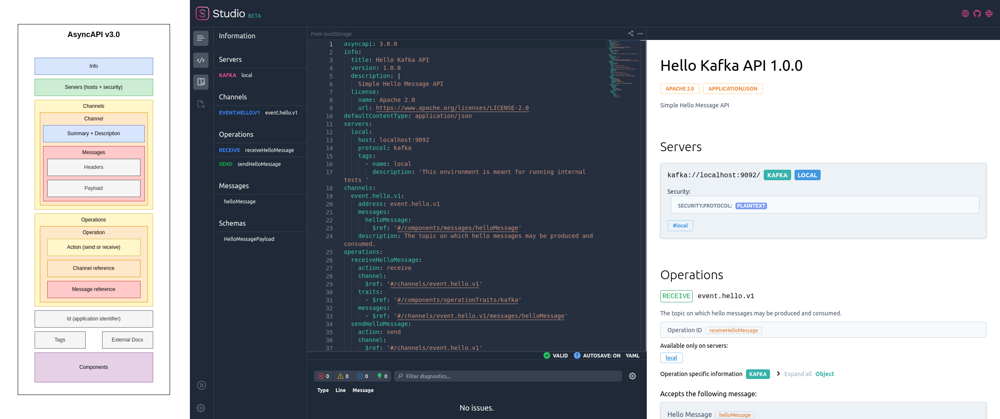


[https://studio.asyncapi.com/](https://studio.asyncapi.com/)


Comme pour OpenAPI nous alons donc commencer par designer une API Asynchrone : un simple Hello World.

AsyncAPI propose l’outil studio.asyncapi, mais il existe également des plugins IDE (comme pour VSCode).

### Des outils

* [https://www.asyncapi.com/tools](https://www.asyncapi.com/tools)
* [Springwolf](https://github.com/springwolf/springwolf-core)
* [HTML Documentation](https://github.com/asyncapi/html-template)
* [MultiAPI Generator](https://github.com/sngular/scs-multiapi-plugin)
* [ZenWave SDK](https://github.com/zenwave360/zenwave-sdk)
* [Diff-Viewer](https://github.com/udamir/api-diff-viewer)
* ...

```bash
ag /home/pbousquet/Workspaces/SQLI/talks/asyncapi-design-first/demo/asyncapi-2/hello-asyncapi.yaml \
   @asyncapi/html-template \
   -p singleFile=true \
   -p outFilename=doc-hello-asyncapi.html
```


AsyncAPI propose un grand nombre d’outils pour de la génération soit documentaire, soit de code.

L’exemple présenté ici permet notamment de générer une documentation HTML à parti de la spécification AsyncAPI.

À noter que les outils de génération de code permettent de générer des applications complètes, alors que nous recherchons plus un outil comme le plugin maven openapi-generator qui permet de s’intégrer dans un projet existant.

```
ag /home/pbousquet/Workspaces/SQLI/talks/asyncapi-design-first/demo/asyncapi-2/hello-asyncapi.yaml \
   @asyncapi/java-spring-template \
   -p maven=true \
   -p javaPackage=com.sqli.pbousquet.hello.asyncapi \
   -p springBoot2=true
```

### Démo


## ZenWave SDK

* Accélérer le developpement API

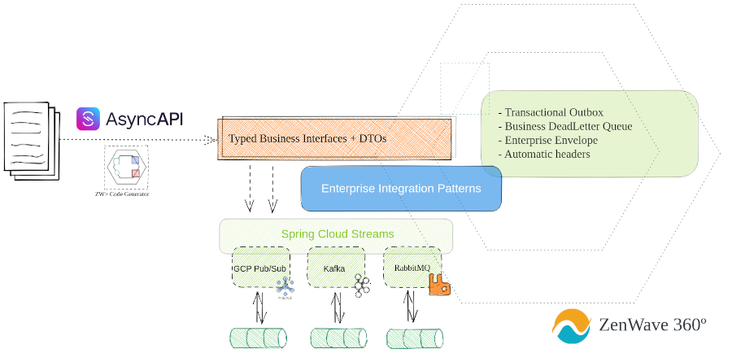

[https://zenwave360.github.io/](https://zenwave360.github.io/)


Iván García Sainz-Aja développe de son coté un SDK proposant diverses chose :

* API First (OpenAPI, Async API)
* DDD (à partir d’un DSL)
* API Testing
* ...

Et notemment deux plugins maven : https://zenwave360.github.io/zenwave-sdk/zenwave-sdk-maven-plugin/

* générer les DTOs depuis une spécification AsyncAPI
* générer le code producer/consumer basé sur spring-cloud-streams (compatible notamment Kafka et RabbitMQ)

### Generation DTOs

```xml
<plugin>
  <groupId>io.github.zenwave360.zenwave-sdk</groupId>
  <artifactId>zenwave-sdk-maven-plugin</artifactId>
  <version>${zenwave.version}</version>
  <executions>
    <execution>
      <id>generate-asyncapi-producer-dtos</id>
      <phase>generate-sources</phase>
      <goals>
        <goal>generate</goal>
      </goals>
      <configuration>
        <generatorName>jsonschema2pojo</generatorName>
        <inputSpec>..../hello-asyncapi.yaml</inputSpec>
        <targetFolder>${project.build.directory}/generated-sources</targetFolder>
        <configOptions>
          <modelPackage>com.sqli.pbousquet.hello.model</modelPackage>
          <jsonschema2pojo.includeJsr303Annotations>true</jsonschema2pojo.includeJsr303Annotations>
          <jsonschema2pojo.isUseJakartaValidation>true</jsonschema2pojo.isUseJakartaValidation>
        </configOptions>
      </configuration>
    </execution>
  </executions>
</plugin>            
```

* modelPackage : package pour le DTO
* isUseJakartaValidation : pour Java 17+ / Spring Boot 3


### Le Producer

```xml
<plugin>
  <groupId>io.github.zenwave360.zenwave-sdk</groupId>
  <artifactId>zenwave-sdk-maven-plugin</artifactId>
  <version>${zenwave.version}</version>
  <executions>
    <execution>
      <id>generate-asyncapi-producer</id>
      <phase>generate-sources</phase>
      <goals>
        <goal>generate</goal>
      </goals>
      <configuration>
        <generatorName>spring-cloud-streams3</generatorName>
        <inputSpec>..../hello-asyncapi.yaml</inputSpec>
        <targetFolder>${project.build.directory}/generated-sources</targetFolder>
        <configOptions>
          <operationIds>sendHelloMessage</operationIds>
          <apiPackage>com.sqli.pbousquet.hello.producer</apiPackage>
          <modelPackage>com.sqli.pbousquet.hello.model</modelPackage>
        </configOptions>
      </configuration>
    </execution>
  </executions>
</plugin>            
```

* apiPackage : package pour le code
* modelPackage : package du DTO
* operationIds : operations à générer


### Code Généré

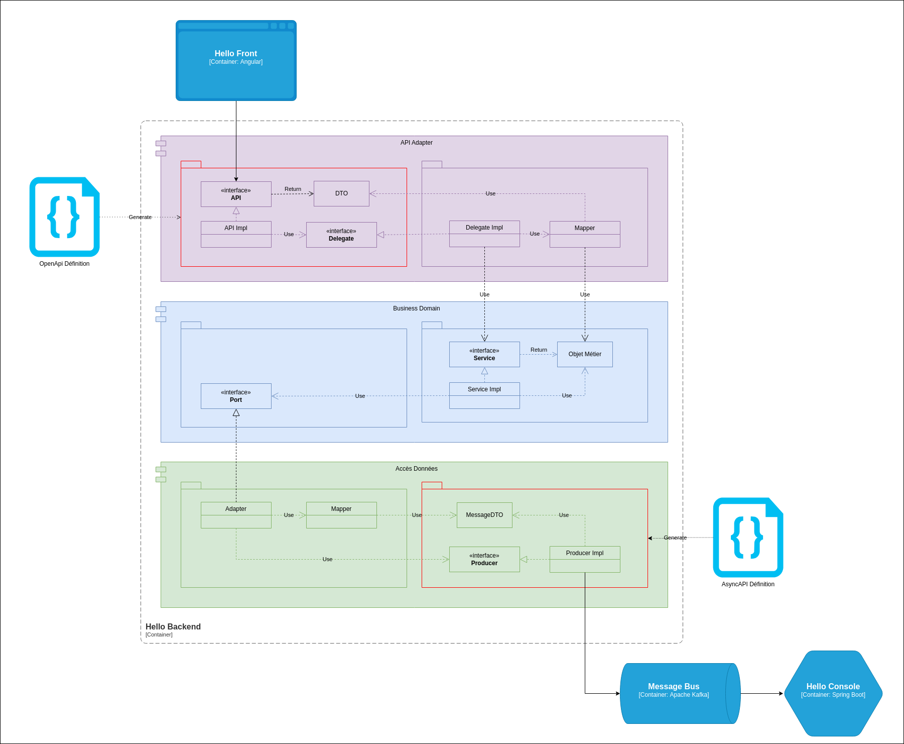


Ici il génère : 

* L’interface et l’implémentation de production
* Le DTO : la structure du message

### Implémenter


```java
package com.sqli.pbousquet.hello.service;

import org.springframework.beans.factory.annotation.Autowired;
import org.springframework.scheduling.annotation.Scheduled;
import org.springframework.stereotype.Component;
import com.sqli.pbousquet.hello.producer.IDefaultServiceEventsProducer;
import com.sqli.pbousquet.hello.model.HelloMessagePayload;
@Component
public class HelloService {
    
    @Autowired
    IDefaultServiceEventsProducer service;

    @Scheduled(fixedRate = 5000)
    public void sendHelloMessage() {
        HelloMessagePayload helloMessage = new HelloMessagePayload();
        helloMessage.setMessage("Hello fifi");
        service.sendHelloMessage(helloMessage, null);
    }
}
```


Le développeur lui n’a plus qu’à implémenter :

* L’adapter faisant l’appel à la couche technique
* Éventuellement un mappeur Objet Métier / DTO 

### Démo


## Le Consumer

```xml
<plugin>
  <groupId>io.github.zenwave360.zenwave-sdk</groupId>
  <artifactId>zenwave-sdk-maven-plugin</artifactId>
  <version>${zenwave.version}</version>
  <executions>
    <execution>
      <id>generate-asyncapi-receiveir</id>
      <phase>generate-sources</phase>
      <goals>
        <goal>generate</goal>
      </goals>
      <configuration>
        <generatorName>spring-cloud-streams3</generatorName>
        <inputSpec>..../hello-asyncapi.yaml</inputSpec>
        <targetFolder>${project.build.directory}/generated-sources</targetFolder>
        <configOptions>
          <operationIds>readHelloMessage</operationIds>
          <apiPackage>com.sqli.pbousquet.hello.receiver</apiPackage>
          <modelPackage>com.sqli.pbousquet.hello.model</modelPackage>
        </configOptions>
      </configuration>
    </execution>
  </executions>
</plugin>            
```

* apiPackage : package pour le code
* modelPackage : package du DTO
* operationIds : operations à générer


### Code Généré

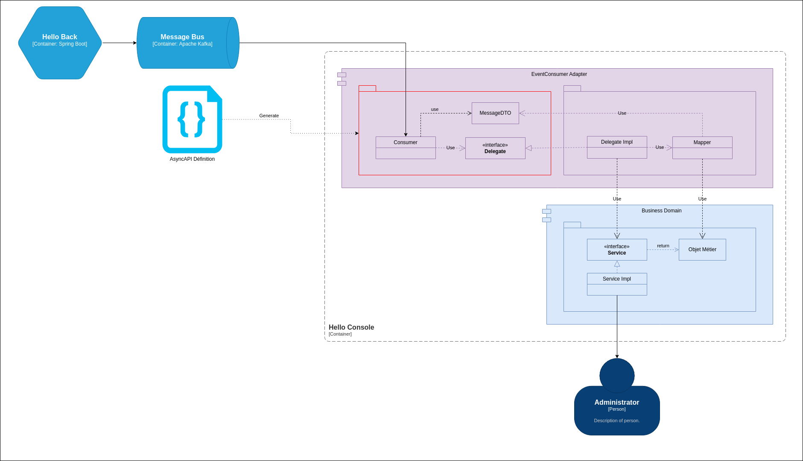


Ici il génère : 

* L’interface et l’implémentation de production
* Le DTO : la structure du message

### Implémenter


```java
package com.sqli.pbousquet.hello.service;

import org.springframework.stereotype.Component;
import com.sqli.pbousquet.hello.model.HelloMessagePayload;
import com.sqli.pbousquet.hello.receiver.IReadHelloMessageConsumerService;
@Component
public class HelloService implements IReadHelloMessageConsumerService {
    
    @Override
    public void readHelloMessage(HelloMessagePayload payload, HelloMessagePayloadHeaders headers) {
        System.out.println(payload.getMessage());
    }

}
```


Le développeur lui n’a plus qu’à implémenter :

* L’implémentation du délegate 
* Éventuellement un mappeur DTO / Objet Métier 

### Démo


## Notre Cas d'Usage


## Pour conclure


* OPENAPI ET ASYNCAPI
* IMPLÉMENTER PLUS EFFICACEMENT VOS APIS
* INTÉGRER PLUS FACILEMENT LES APPELS À VOS APIS
* POSSIBILITÉ DE SIMULER VOS APIS
* DOCUMENTATION EN ADÉQUATION AVEC L’IMPLÉMENTATION RÉELLE


## Merci


[Retrouvez la présentation ici](https://github.com/darken33/design-first-allinone)


